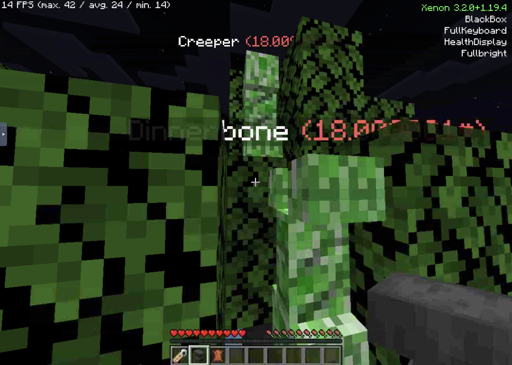

## Xenon Feature Documentation

All are open for suggestions and PRs!

 

### Chat

**QuickChat**

Send a custom message at the push of a button!

Note: commands will be sent as a chat message, fix for that is WIP

| **Option** | **Max/Min** | **Default Value** |
|------------|-------------|-------------------|
| Message    | NA          | (Blank)           |

 

**MultiQuickChat**

Send one of 10 custom message at the push of two buttons - the feature key and a number key

| **Option** | **Max/Min** | **Default Value** |
|------------|-------------|-------------------|
| Message 0  | NA          | (Blank)           |
| Message 1  | NA          | (Blank)           |
| Message 2  | NA          | (Blank)           |
| Message 3  | NA          | (Blank)           |
| Message 4  | NA          | (Blank)           |
| Message 5  | NA          | (Blank)           |
| Message 6  | NA          | (Blank)           |
| Message 7  | NA          | (Blank)           |
| Message 8  | NA          | (Blank)           |
| Message 9  | NA          | (Blank)           |

 

**ShareLocation**

Send a chat message with your current location and dimension, also at the push of a button. (WIP: /whisper support for public servers)

 

**Infinite Chat Length**

Remove the maximum chat length restriction.

 

### Movement

**Timer**

Speed up your actions! May be considered a hack on some servers, but still genuinely useful where it is allowed. USE AT YOUR OWN RISK; server opt-out available.

| **Option**          | **Max/Min** | **Default Value** | **Comment**              |
|---------------------|-------------|-------------------|--------------------------|
| Speed               | 0.1/50.0    | 1.0               | TPS multiplier           |
| Adjustment interval | 0.1/10.0    | 1.0               | Scroll adjustment amount |

 

**FullKeyboard**

Play Minecraft using only your keyboard!
Disclaimer: Touchscreen still required for some UI interaction (ugh); MidnightControls is *much* better.

(This feature was designed so that I can play Minecraft on my school iPad over VNC)

 

### Render

**Australian Mode**

Joke feature: simulates Australian Minecraft (upside down)

</img>

 

**FullBright**

Full gamma, making every surface clearly visible without lighting effects (incompatible with most shaders)

 

**ProximityRadar**

Outlines nearby players and hostile mobs, optionally through walls. May be considered a hack. (Server opt-out available)

 

**WAILA**

What block is that?

Sub-par WAILA implementation; you're better off using another mod like WTHIT. This is just here for fun.

(This used to show entity health, but that was replaced by HealthDisplay. About the only special element here is that its range can br extended really far.)

 

**HealthDisplay**

Shows mobs' name and health in their nameplates (the name text above their head)

 

**Panorama Generator**

Generate a set of 6 square images in the format of the title screen panorama. Incompatible with shaders, unfortunately.

 

**Zoom**

Look at far-away objects! Adjustable with the scroll wheel.

Compatible with Australian Mode!

 

### Misc

**BlackBox**

Records information like your position, health and death point(s) as you play. A Flight Data Recorder for Minecraft!

 

**CommandProcessor**

Enable/disable features, change their configs,  and run macros, all from the chat.

(Note: no up/down command history access as of 1.19+)

 

**ConfigMenu**

CompleteConfig configuration menu.

 

**FeatureList**

Shows your Xenon version and the features you have enabled.

 

**LazyDFU Integration**

Optimises DFU (DataFixerUpper) just like LazyDFU!

 

### Coming soon
